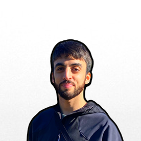
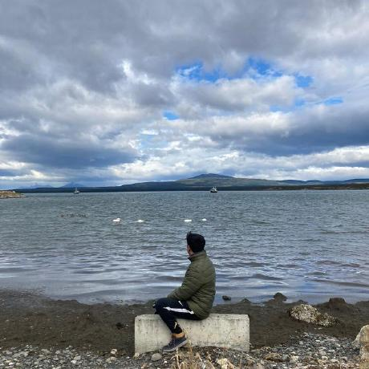

<h1 align="center">🚀 c14-06-m-node-react</h1>

  

<h1 align="center">🏠 Servicios Club</h1>

Servicios Club is a web application designed to assist people in finding professionals to help with their home maintenance. It provides a list of professionals according to the user's location, and allows users to rate and comment on the service received so as to help others find the best worker for their own needs.

You can visit the web application at https://www.serviciosclub.com.

## 👥 Project members:

- Carolina Saggio    (Project Manager, QA)  
- Federico Lucero    (UX/UI Designer)  
- Andrés Boni        (Frontend Developer)  
- Ruben Gonzalez     (Frontend Developer)  
- Juan Nebbia        (Backend Developer)  
- Gabriel Althaparro (Backend Developer)

## 🛠️ Stacks/Technologies:

### ✔ Project Manager/QA

| 
|:-:|
| **Carolina Saggio**|
|

 

### ✔ UX/UI

| 
|:-:|
| **Federico Lucero**|
|
|

 

### ✔ Frontend:

| | |
|:-:|:-:|
| **Ruben Gonzalez**| **Andrés Boni**|
 |  

 

### ✔ Backend:

| | |
|:-:|:-:|
| **Gabriel Althaparro**| **Juan Nebbia**|
  | |

 

